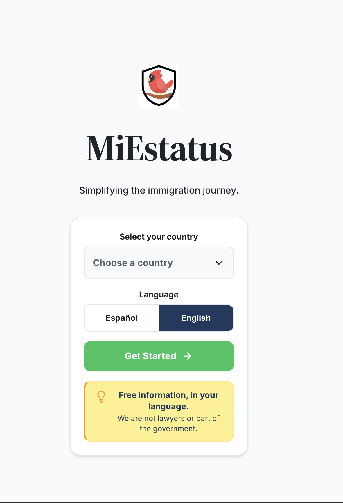
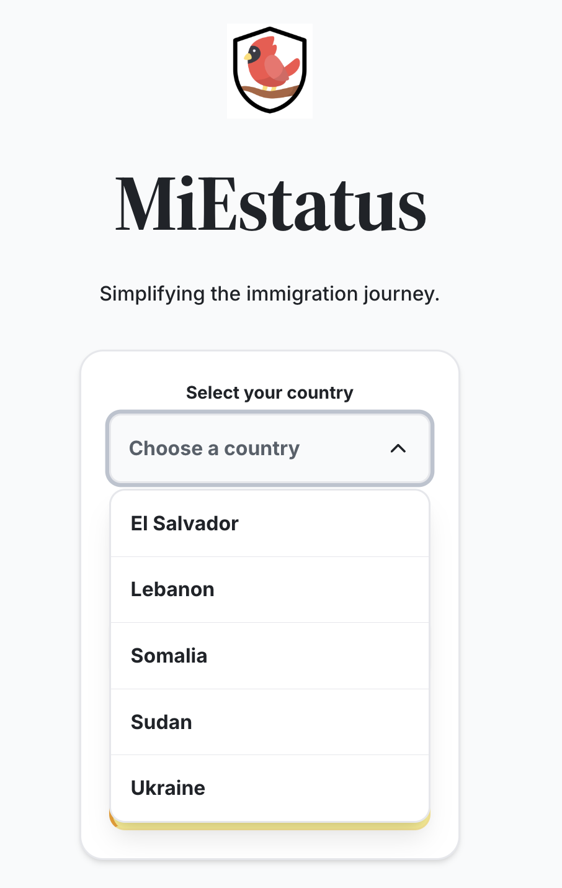
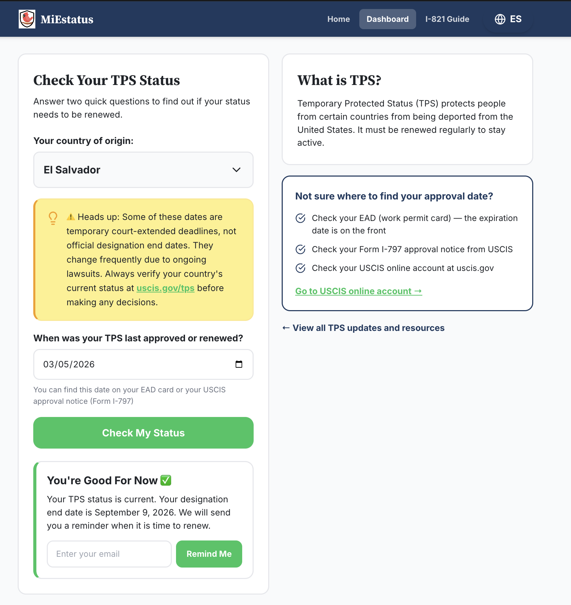
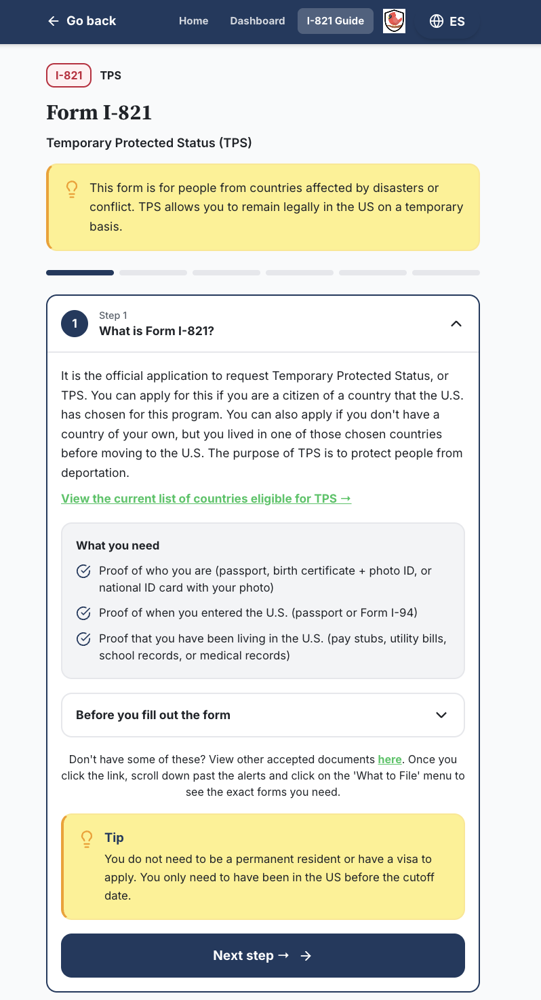
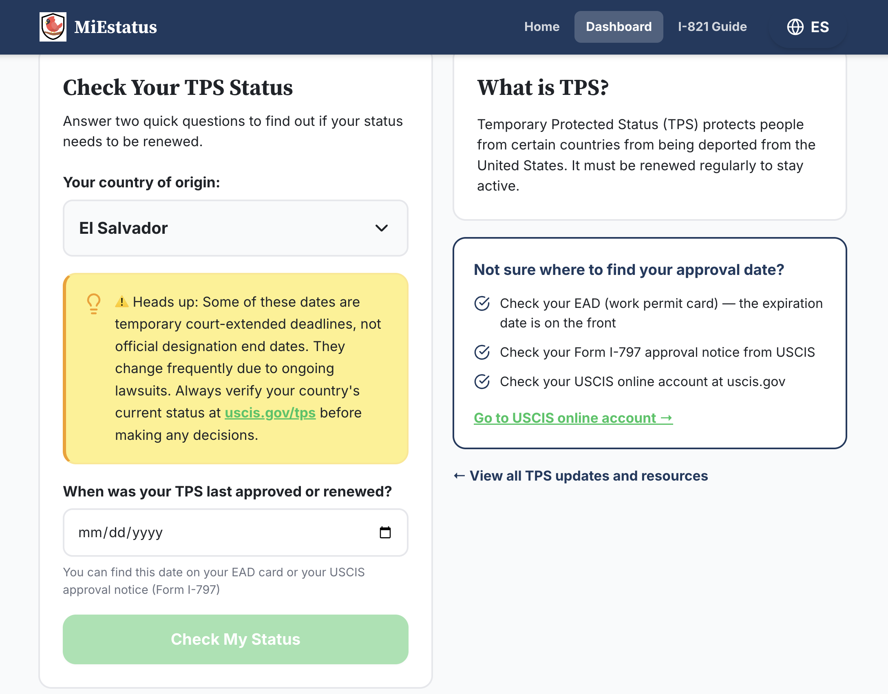

Built for the RLC Hacks 2026. MiEstatus was created over a single week to simplify the immigration journey by providing multilingual resources, USCIS case tracking, accessibility features, and educational tools in an inclusive, easy-to-use platform.

## AI Tool Disclosure

AI tools were used during development as coding assistance.

Bolt.new was used to accelerate frontend development, generate initial implementation support, and assist with debugging and refinement.

The project concept, feature decisions, user experience design, content organization, testing, and final integration were completed by the developer.

All generated code was reviewed, modified, and integrated into the final application.

# MiEstatus | Your Immigration Companion

**Simplifying the immigration journey.**

MiEstatus is a bilingual (English / Spanish) web application that helps individuals from TPS-eligible countries navigate the immigration process. It provides up-to-date news, form guides, deadline tracking, and a status checker — all presented in plain language and the user's preferred language.

---

## Overview

Navigating the U.S. immigration system is complex, especially for Temporary Protected Status (TPS) holders who must track deadlines, re-registration windows, and form changes. MiEstatus centralizes this information in a single, mobile-friendly interface. Users select their country, view relevant updates and resources, walk through a step-by-step I-821 form guide, and check whether their TPS status needs renewal.

The app is designed for non-technical users: no account is required, all content is free, and everything is available in both English and Spanish with a one-tap language toggle.

---

## Features

- **Bilingual Interface** — Every screen, string, and piece of content is available in both English and Spanish. Users can toggle languages at any time without losing their place.

- **Country-Scoped Dashboard** — Users select their country (El Salvador, Lebanon, Somalia, Sudan, Ukraine, and more) and see news, forms, deadlines, and resources relevant to them.

- **TPS Status Checker** — A two-question tool that asks for the user's country and last approval date, then calculates whether they need to act now, should prepare to renew soon, or are currently in good standing. Users can sign up for email reminders.

- **Step-by-Step I-821 Guide** — A six-step interactive walkthrough for completing Form I-821 (TPS application), covering eligibility, personal information, travel history, criminal history, submission, and post-filing expectations. Each step includes collapsible subsections, tips, important warnings, relevant resources located within the website, and direct links to official USCIS resources.

- **Forms & Deadlines Tracking** — Cards for each relevant form (I-821, I-765, I-131, I-912) with download links, filing instructions, and deadline information.

- **Resource Directory** — Curated links to free translators, legal clinics, case status checkers, ASC locators, free or low cost transportation options, immigration attorneys, verified preparers, and consulate finders. Includes warnings about notario fraud common in immigrant communities.

- **Email Reminders (Coming Soon)** — Backend support has been prepared for future notifications when TPS re-registration windows open or when a user's status approaches expiration.

- **Smart Link Detection** — Content automatically detects references to USCIS forms, phone numbers, and external resources, turning them into clickable links inline.

- **Responsive Design** — Optimized for mobile-first use with a clean, accessible layout that works from phone to desktop.

---

## Technologies Used

| Category | Technology |
|---|---|
| Framework | React 18 |
| Build Tool | Vite 5 |
| Language | TypeScript 5 |
| Styling | Tailwind CSS 3 |
| Icons | lucide-react |
| Backend / Database | Supabase (PostgreSQL) |
| Fonts | Inter (body), Source Serif 4 (headings) |

---

## Project Structure

```
.
├── index.html                      # HTML entry point with OG meta tags & favicon
├── package.json                    # Dependencies and scripts
├── tailwind.config.js              # Tailwind theme (colors, fonts)
├── vite.config.ts                  # Vite configuration
├── postcss.config.js               # PostCSS configuration
├── tsconfig.json                   # TypeScript configuration
├── public/
│   ├── logo.png                    # MiEstatus cardinal logo (also used as favicon)
│   └── assets/
│       └── images/
│           └── Translate_website.gif
├── src/
│   ├── main.tsx                    # React entry point
│   ├── App.tsx                     # Main application (all screens & components)
│   ├── content.ts                  # All bilingual content, strings, updates, steps
│   ├── index.css                   # Global styles (Tailwind directives, base font)
│   ├── vite-env.d.ts               # Vite environment type declarations
│   └── lib/
│       └── supabase.ts             # Supabase client initialization
└── supabase/
    └── migrations/
        ├── 20260729084555_create_status_reminders.sql
        └── 20260729085638_allow_null_designation_end_date.sql
```

### Key Files

- **`src/App.tsx`** — Contains all application screens: Landing, Dashboard, FormGuide, and StatusChecker, plus shared components like NavBar, CountryPicker, Disclaimer, and TipBox.
- **`src/content.ts`** — The single source of truth for all text content. Defines the `STRINGS`, `UPDATES`, `STEPS`, `TPS_DESIGNATIONS`, and `COUNTRIES` data structures, each keyed by language (`es` / `en`).
- **`src/lib/supabase.ts`** — Initializes the Supabase client using environment variables for URL and anon key.

---

## Setup Instructions

### Prerequisites

- Node.js 18+ and npm
- A Supabase project (URL and anon key)

### Installation

1. **Clone the repository**

   ```bash
   git clone <repository-url>
   cd miestatus
   ```

2. **Install dependencies**

   ```bash
   npm install
   ```

3. **Configure environment variables**

   Create a `.env` file in the project root with your Supabase credentials:

   ```env
   VITE_SUPABASE_URL=your-supabase-project-url
   VITE_SUPABASE_ANON_KEY=your-supabase-anon-key
   ```

4. **Run the database migrations**

   Apply the SQL migrations in `supabase/migrations/` to your Supabase project to create the `status_reminders` table and enable row-level security.

5. **Start the development server**

   ```bash
   npm run dev
   ```

   The app will be available at `http://localhost:5173`.

### Available Scripts

| Script | Description |
|---|---|
| `npm run dev` | Start the Vite development server |
| `npm run build` | Build the production bundle to `dist/` |
| `npm run preview` | Preview the production build locally |
| `npm run lint` | Run ESLint |
| `npm run typecheck` | Run TypeScript type checking |

---

## Database

The app uses a single Supabase table:

### `status_reminders`

| Column | Type | Description |
|---|---|---|
| `id` | uuid (PK) | Auto-generated unique identifier |
| `email` | text | User's email for notifications |
| `country` | text | Selected TPS country |
| `reminder_type` | text | Notification preference |
| `designation_end_date` | date | TPS designation end date at time of signup |
| `created_at` | timestamptz | Record creation timestamp |

The reminder subscription system has been implemented as a backend-ready feature and is currently marked as "Coming Soon" in the application while notification workflows are finalized.

Row-level security is enabled in Supabase to protect database access.

---

## Supported Countries

The app currently supports only the designated TPS-eligible countries:

- El Salvador
- Lebanon
- Somalia
- Sudan
- Ukraine

Additional countries (Haiti, Honduras, Venezuela, Syria, Yemen, Ethiopia, Nepal, Nicaragua, South Sudan, Myanmar) have TPS designation data in the system and appear in the status checker.

---

## Screenshots

Screenshots showcasing key features of the MiEstatus application:

| Screen | Preview |
|---|---|
| Landing Page |  |
| Country Picker |  |
| Dashboard |  |
| I-821 Form Guide |  |
| Status Checker |  |
| Status Results |  |

---

## Future Improvements

- **Automated USCIS News Sync** — Pull real-time updates from USCIS feeds instead of manually curating news cards.
- **Account & Saved Profiles** — Let users create accounts to save their country, status, and reminder preferences across devices.
- **Interactive Form Filler** — Guide users through filling out Form I-821 field by field with validation and a printable summary.
- **ASC & Consulate Locator** — Map-based tool to find the nearest Application Support Center, or consulate, filtered by distance.
- **Verified Preparer Directory** — Searchable directory of vetted immigration form preparers and accredited representatives with ratings and pricing, while also being filtered by distance.
- **Multi-Country Support** — Expand dashboard content beyond El Salvador to all TPS-designated countries.
- **Push Notifications** — Beyond email, add SMS or browser push notifications for deadline reminders.
- **Accessibility Audit** — Full WCAG 2.1 AA compliance review and screen reader testing.
- **Analytics** — Track which resources and forms are most used to prioritize content development.

---

## License

This project is open source. See the repository for licensing details.

## Disclaimer

MiEstatus provides free educational information and is not affiliated with any government agency. We are not lawyers. For specific legal advice, consult a licensed immigration attorney.
